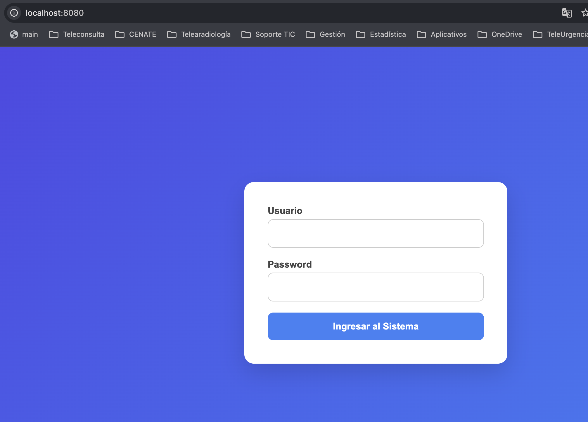
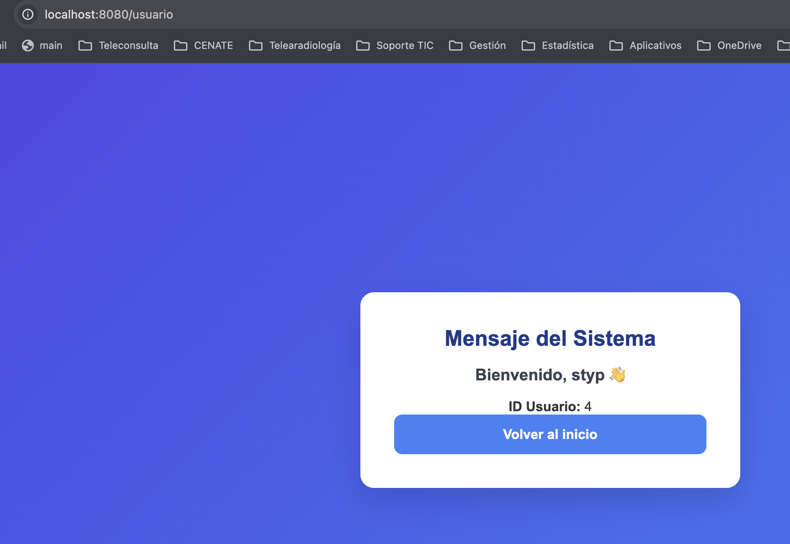
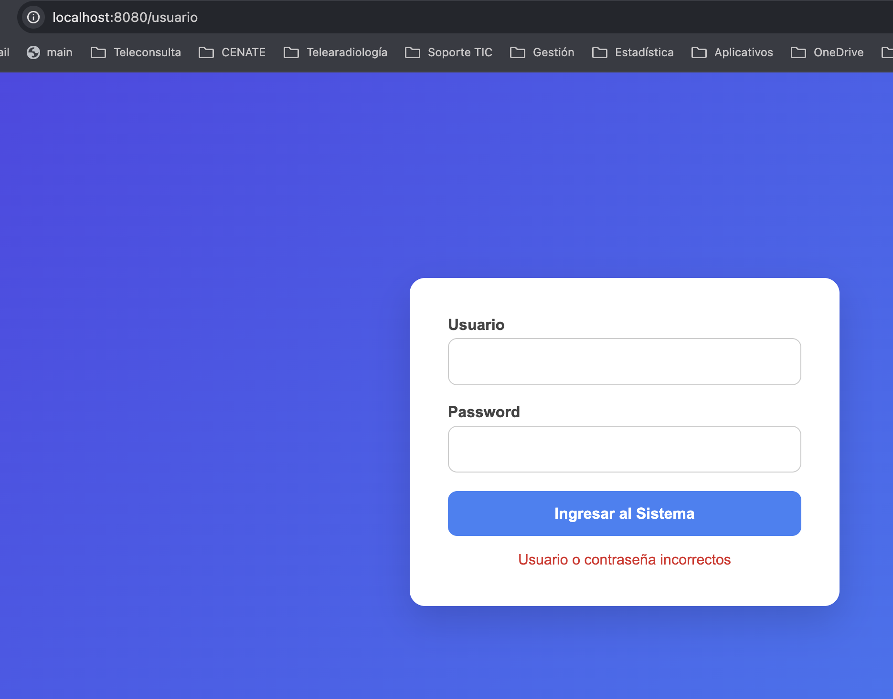

# Lab 14 - Implementación Web con Servlets, JSP y Reportes PDF

Este proyecto es una aplicación web en Java que implementa un CRUD básico de usuarios utilizando Servlets, JSP, JDBC y MySQL, y ahora incluye generación de reportes PDF con JasperReports.

La aplicación permite registrar, listar y gestionar usuarios en una base de datos, así como generar un reporte PDF profesional de todos los usuarios.

---

## 🚀 Tecnologías utilizadas

- **Java 17+**
- **Jakarta Servlet API**
- **JSP (Java Server Pages)**
- **JDBC**
- **MySQL 8**
- **Maven**
- **HTML5, CSS3**
- **JasperReports 6.x**

---

## 📂 Estructura del proyecto

```src
├── main
│   ├── java
│   │   └── styp
│   │       └── com
│   │           └── lab13implementacionweb
│   │               ├── controller
│   │               │   ├── UsuarioServlet.java       # Controlador principal
│   │               │   └── ReporteUsuariosServlet.java # Genera el PDF con JasperReports
│   │               ├── dao
│   │               │   ├── ConnectionDB.java        # Conexión a la BD
│   │               │   ├── IUsuarioDAO.java         # Interfaz DAO
│   │               │   └── UsuarioDAOImpl.java     # Implementación DAO
│   │               └── dto
│   │                   └── UsuarioDTO.java         # Objeto de transferencia
│   ├── resources
│   │   ├── script.sql                              # Script de creación de BD y tabla usuario
│   │   └── reportes
│   │       └── usuarios.jrxml                       # Diseño del reporte JasperReport
│   └── webapp
│       ├── WEB-INF
│       │   └── web.xml                             # Configuración del proyecto
│       ├── css
│       │   ├── reset.css
│       │   └── structure.css
│       ├── index.jsp                                # Página de inicio
│       └── mensaje.jsp                              # Vista de mensajes
└── test
    ├── java
    └── resources


```


---

## 🗄️ Base de Datos

El script de creación de la base de datos se encuentra en `src/main/resources/script.sql`.

Ejemplo de tabla `usuario`:

```sql
CREATE TABLE `usuario` (
                         `id` BIGINT AUTO_INCREMENT PRIMARY KEY,
                         `usuario` VARCHAR(50) NOT NULL UNIQUE,
                         `clave` VARBINARY(255)(255) NOT NULL
) ENGINE=InnoDB DEFAULT CHARSET=utf8mb4;


-- Datos iniciales
INSERT INTO usuario (usuario, clave)
VALUES
  ('styp',  AES_ENCRYPT('1234','cibertec')),
  ('admin', AES_ENCRYPT('admin123','cibertec')),
  ('juan',  AES_ENCRYPT('clave123','cibertec'));


SELECT usuario, CAST(AES_DECRYPT(clave,'cibertec') AS CHAR) AS clave
FROM usuario;
```

---

## 📸 Imágenes del Login

### 🔹 Página Inicial
Vista principal del sistema, donde se presenta el formulario de inicio de sesión.



---

### 🔹 Página Logueada
Vista después de un inicio de sesión exitoso, mostrando la pantalla protegida para usuarios autenticados.



---

### 🔹 Página sin Login
Vista cuando un usuario intenta acceder a una página restringida sin haberse autenticado.



---

### 📊 Flujo de JasperReports (de JRXML a PDF)
El reporte de usuarios se genera siguiendo estos pasos:

```sql
+-----------------+      compile       +----------------+
|                 | ----------------> |                |
|  usuarios.jrxml |                   |  usuarios.jasper|
|  (diseño XML)   |                   | (compilado)    |
+-----------------+                   +----------------+
         |                                     |
         | fillReport                           |
         v                                     v
+-----------------+      export PDF     +----------------+
|                 | ----------------> |                |
|  Datos BD/MySQL |                   |  usuarios.pdf  |
|  (id, usuario,  |                   |  (reporte final|
|   clave)        |                   |   en PDF)      |
+-----------------+                   +----------------+

```
### 🔹 Explicación paso a paso

**1️⃣ Diseño JRXML**
- Archivo XML que define el reporte: campos, título, encabezados, colores y fuentes.
- **Ubicación:** `src/main/resources/reportes/usuarios.jrxml`.

**2️⃣ Compilación (`JasperCompileManager.compileReport`)**
- Convierte el JRXML en un archivo `.jasper` que JasperReports puede usar internamente.
- Es como traducir tu diseño en instrucciones que Java entiende.

**3️⃣ Rellenar datos (`JasperFillManager.fillReport`)**
- Se conecta a la base de datos (MySQL).
- Llena el reporte con los registros de la tabla `usuario`.

**4️⃣ Exportar a PDF (`JRPdfExporter`)**
- Toma el reporte rellenado y lo convierte en un archivo PDF.
- Se puede mostrar en el navegador o descargar directamente.

###  🔹 Ejemplo de código del Servlet

```java
@WebServlet(name = "ReporteUsuariosServlet", value = "/reporte-usuarios")
public class ReporteUsuariosServlet extends HttpServlet {

    @Override
    protected void doGet(HttpServletRequest request, HttpServletResponse response)
            throws ServletException, IOException {
        // Ruta del JRXML
        String jrxml = getServletContext().getRealPath("/WEB-INF/reportes/usuarios.jrxml");

        try (Connection conn = ConnectionDB.getConnection()) {
            // Compilar
            JasperReport report = JasperCompileManager.compileReport(jrxml);

            // Rellenar datos desde la BD
            JasperPrint print = JasperFillManager.fillReport(report, null, conn);

            // Configurar PDF en respuesta HTTP
            response.setContentType("application/pdf");
            response.setHeader("Content-Disposition", "inline; filename=usuarios.pdf");

            // Exportar PDF
            JRPdfExporter exporter = new JRPdfExporter();
            exporter.setExporterInput(new SimpleExporterInput(print));
            exporter.setExporterOutput(new SimpleOutputStreamExporterOutput(response.getOutputStream()));
            exporter.exportReport();

        } catch (JRException | SQLException e) {
            e.printStackTrace();
            response.sendError(HttpServletResponse.SC_INTERNAL_SERVER_ERROR, e.getMessage());
        }
    }
}

```
### 💡 Tip:

El flujo JRXML → .jasper → PDF es estándar en JasperReports y te permite cambiar el diseño del PDF sin tocar el código Java.


### 🔹 Vista de documento PDF creado por jasper


---
## Cómo ejecutarlo
## 1️⃣ `docker-compose down --volumes --remove-orphans`

- **`docker-compose down`** → Detiene y elimina los contenedores definidos en tu `docker-compose.yml`.
- **`--volumes`** → Elimina los volúmenes asociados (por ejemplo, datos de MySQL). Esto reinicia la base de datos desde cero.
- **`--remove-orphans`** → Borra contenedores que están corriendo pero **no** están en el `docker-compose.yml` actual (restos de pruebas viejas).

💡 **Uso principal:** Dejar el entorno limpio y evitar conflictos con versiones anteriores.

---

## 2️⃣ `docker-compose build --no-cache`

- **`docker-compose build`** → Reconstruye las imágenes de los servicios.
- **`--no-cache`** → Ignora la caché y fuerza la reconstrucción desde cero (descarga de dependencias, copia de archivos, etc.).

💡 **Uso principal:** Útil cuando hiciste cambios en el código y no quieres que Docker use versiones antiguas.

---

## 3️⃣ `docker-compose up`

- Levanta los contenedores definidos en `docker-compose.yml`.
- Si quieres ver logs en vivo, simplemente ejecútalo así:
  ```bash
  docker-compose up

## Conexión de base datos
jdbc:mysql://localhost:3306/asistencia?allowPublicKeyRetrieval=true&useSSL=false